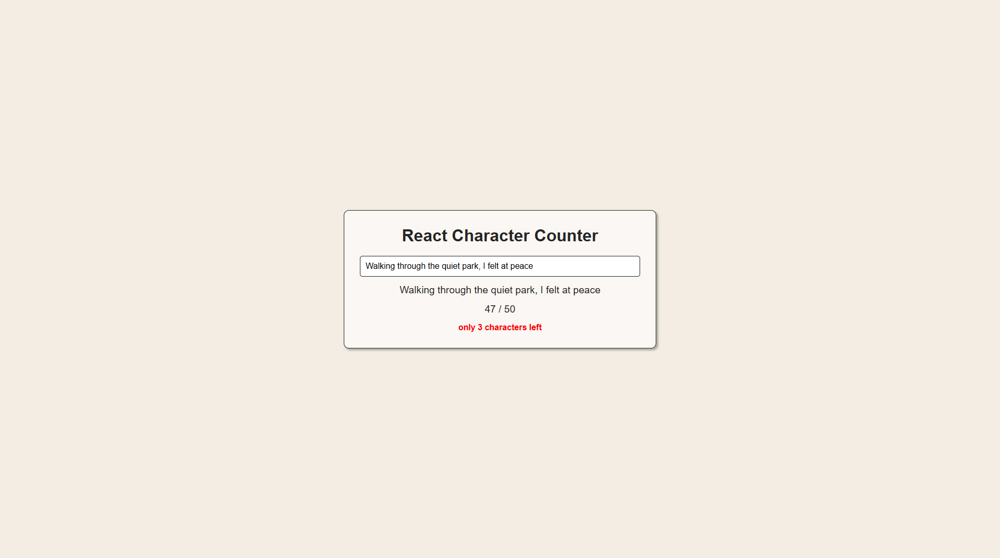

# React Remaining Character Counter
A simple and clean React application that tracks user input in real-time and displays the number of remaining characters based on a fixed limit.
The app also provides a visual warning when the user approaches the limit.



## Features
- Real-time character counting
- Configurable character limit (default: 50)
- Warning message 10 characters before the limit
- Prevents input beyond the defined limit
- Clean and minimal UI

## Tech Stack
- HTML5
- CSS3
- JavaScript (ES6+)
- React
- React DOM
- Vite

## Project Structure
```text
react-counter
├── index.html
├── package.json
├── package-lock.json
├── vite.config.js
├── screenshot.jpg
└── src/
    ├── index.jsx
    └── styles.css
```

## Requirements
Before running this project, ensure the following software is installed:

- Node.js
- npm (comes with Node.js)

You can verify installation by running:

```bash
npm -v  
node -v
```

## Installation
1. Clone the repository:

```bash
git clone https://github.com/dmitry-backend/react-counter.git
```

2. Navigate to the project directory:

```bash
cd react-counter
```

3. Install project dependencies:

```bash
npm install
```

This installs all dependencies defined in package.json.

## Running the Development Server
Start the local development server using:

```bash
npm run dev
```

Vite will start a development server and provide a local URL similar to:

`http://localhost:5173`

Open this URL in your browser to view the application.

During development, Vite automatically reloads the page when changes are made to the source files.

## Customization
To change the character limit, modify:
```javascript
const limit = 100;
```

To adjust the warning threshold, modify the condition:
```javascript
remaining <= 20
```

## License
This project is licensed under the MIT License.